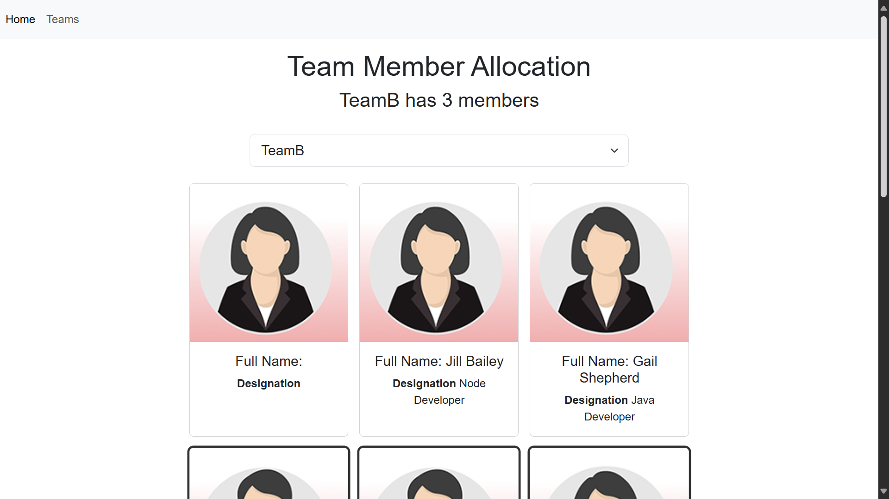

# 👨‍💼 Employee Management Platform

## Overview

This is a Employee Management Platform built using React. The users can efficiently allocate team members to different projects and departments, making it easy to manage workforce distribution and collaboration.

## 🔗 Project URL

Check out the live version of the project here: [Employee-App](https://employee-app-project.netlify.app/)

## 🖼️ Screenshots

## 🛠️ Technologies Used

- **React:** A JavaScript library for building user interfaces.

## ✨ Features

- **Responsive Layout:** The platform is designed to work seamlessly across desktops, tablets, and mobile devices, ensuring accessibility and ease of use on any screen size.
- **Team Member Allocation:** Efficiently allocate team members to different projects and departments, making it easy to manage workforce distribution and collaboration.

## 🚀 Getting Started

To run this project locally, follow these steps:

1. Clone the repository: `git clone https://github.com/Developer-Bilal/employee-app.git`
2. Navigate to the project directory: `cd employee-app`
3. npm install
4. npm start

The application should now be running on http://localhost:3000.

## 📧 Contact

If you have any questions or suggestions, feel free to reach out:

- Email: bilalchanna67@gmail.com ✉️
- LinkedIn: [Profile](https://www.linkedin.com/in/Engineer-Bilal-Channa) 💼
